# Proton Drive Utility App 
- Unofficial
- Currently in: Beta.
- Released Date: 07/03/2026. [MM/DD/YYYY]
- App version: v1.2.6 - updated: 08/22/2026. [MM/DD/YYYY]
- Language: Python + GTK4 + Libadwaita.
- Opened Sourced & Publicly Available.

_________________________________________________________

## 🌟 Lists of benefits on why This App exists and use cases.

<mark>The Proton AG team is working hard</mark> to build the official Proton Drive for Linux systems.

Having a Proton utility app comes with all sorts of benefits:

- <strong>📤 Importing/Exporting in and out of your Proton Drive is just a click of a button.
- <strong>⬇️ A quick way to download everything, rather than using the Proton Drive web interface.
- <strong>💻 Flexibility for lower-end hardware.
- <strong>🔄 The ability to download multiple times, so you know your data is always backed up and safe.
- 
> 💡 *You can probably think of more amazing uses for this great app.*
-
> If and when the Official Proton Drive App has been released by proton AG and their team surely many out there would still use this App.
of the many benefits listed above. ☝️

---

Thank you, <strong> Proton AG </strong>. The community will love and experiment with this app, developing their own ways of using it and wanting more flexibility with Proton's services.

 
 - Home Page
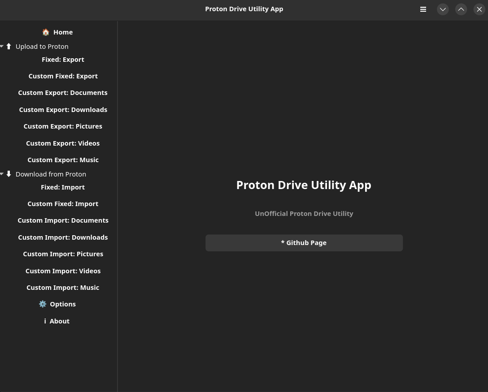

## Compatibility

This app is designed to work with the **Proton Drive CLI binary file**. It executes all commands supported by the underlying CLI, with plenty of options accessible through the graphical interface—eliminating the need for terminal usage.

Future updates will roll out for this app, especially whenever Proton AG releases updates to the Proton Drive CLI binary.

## 🔓 Open Source & Privacy

Great news! This app is **open source**, and the source code is accessible and readable at any time—so you know nothing suspicious is running in the background. No telemetry, no data collection by the developer.

If you want to stay safe and receive trusted updates, please download only from this GitHub page.

---

## ⚠️ Important Note

You **cannot** log in to your Proton AG account using this app. You must use the native Proton Drive client that Proton AG has built for their customers, which you can find here:

> 🔗 https://proton.me/blog/proton-drive-cli

> _Note: This option may be implemented in the future._

---

## 🔐 Your Data, Your Control

Rest assured that you are in control of your data and what is transmitted over the internet. The developer has no intention of accessing or collecting anything. The source code is available to read at any time.

---

## ☕ Support the Project

Thank you! If you'd like to buy me a coffee, you can support me anytime.

## 💡 Ideas & Feedback

If you'd like to suggest ideas on what to add—anything helps make this app better for all Linux users! You can always email me at:

<!-- Add your email here -->
give-me-ideas@mailservices2.simplelogin.com

## Screenshots of the App small features and Accessbilities

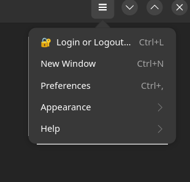
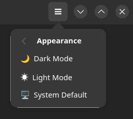
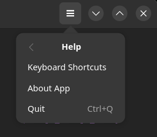

 - Login and Logout UI popup
 -  Yes now you can log in and out with this GUI app.
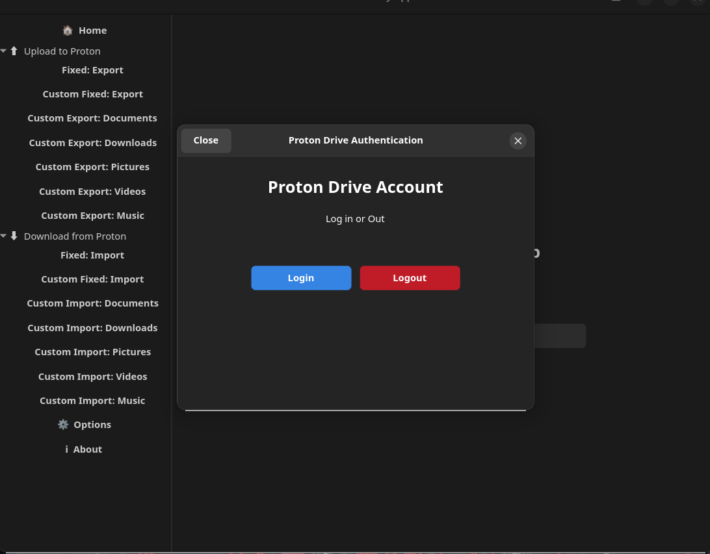
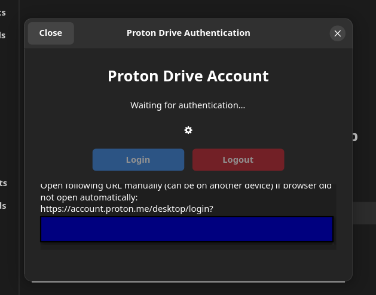
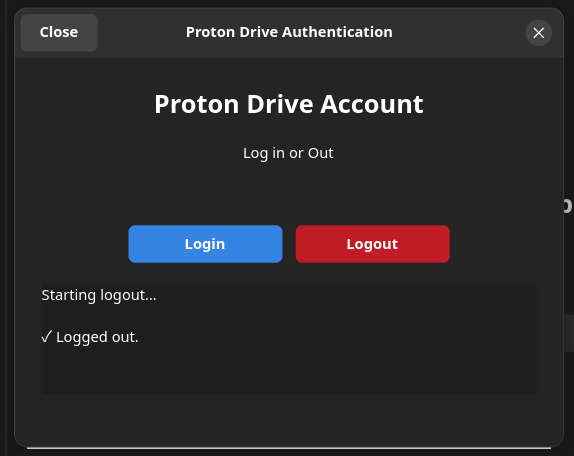

#### Sneak Peak on what the app functions in the Graphical User Interface
- About page
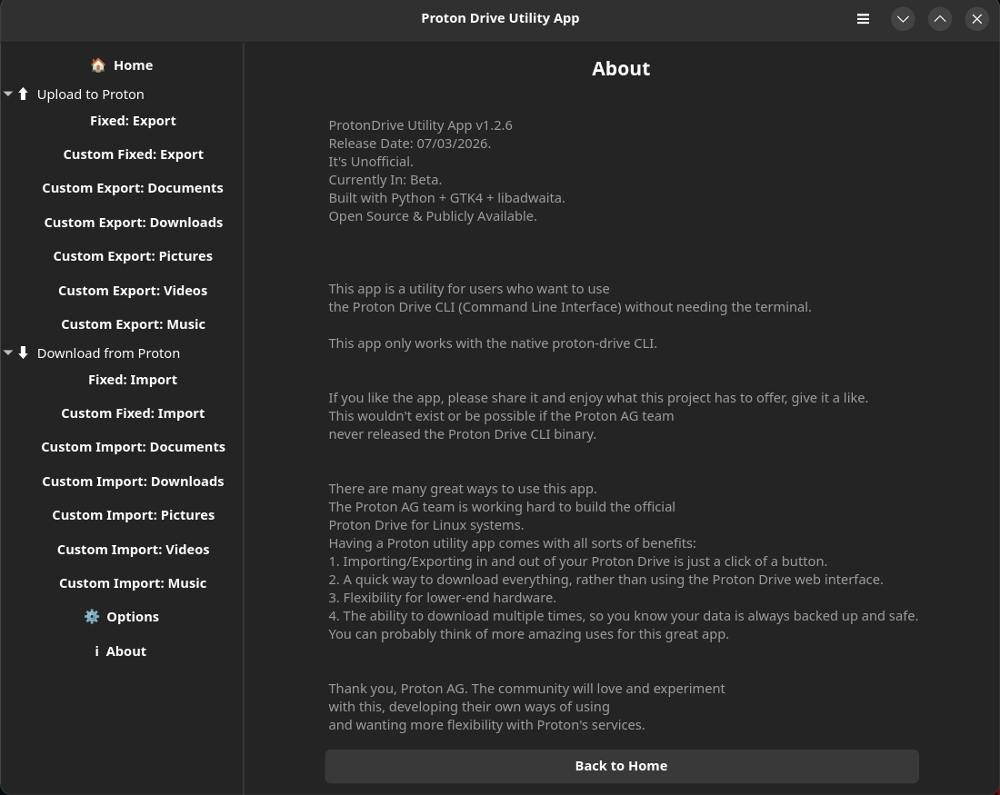
### Custom Fixed directory Uploads and Downloads from/to your proton drive and linux system.
- Custom fixed documents - uploads page and download page
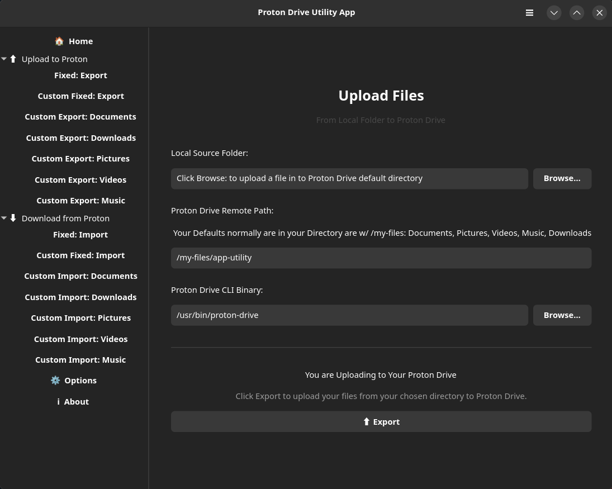
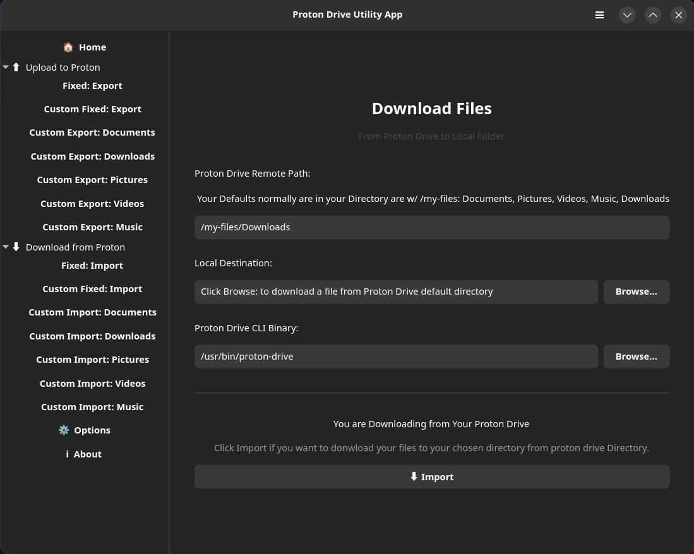
## Custom: choose your directory Uploads and Downloads page from/to your proton drive and linux system. 

- Custom documents - uploads page and downloads page
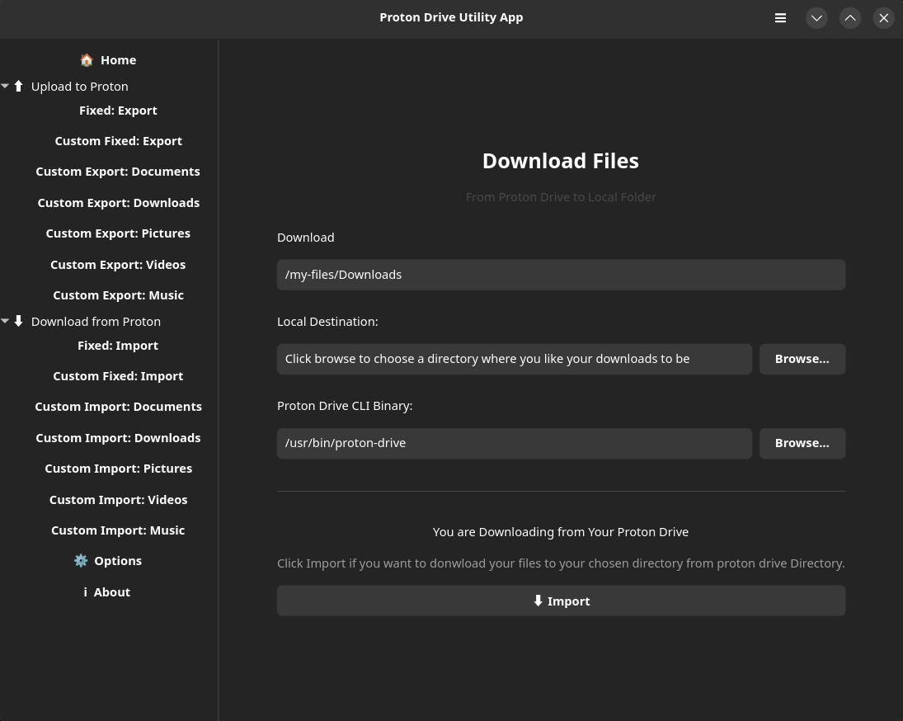
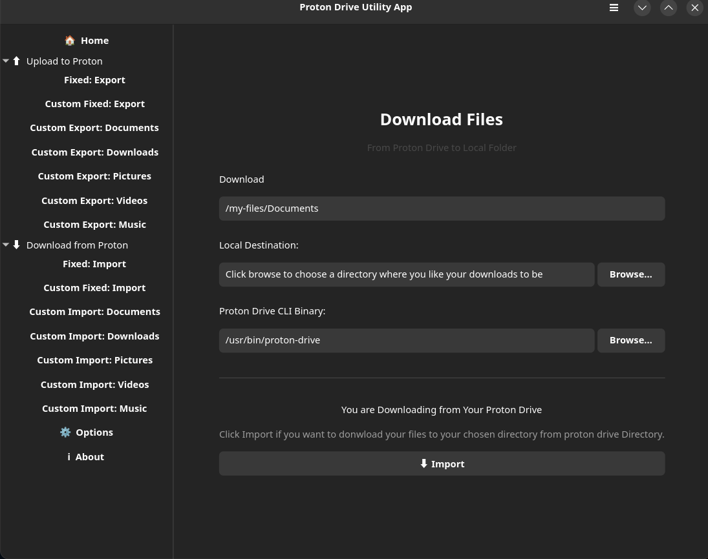

