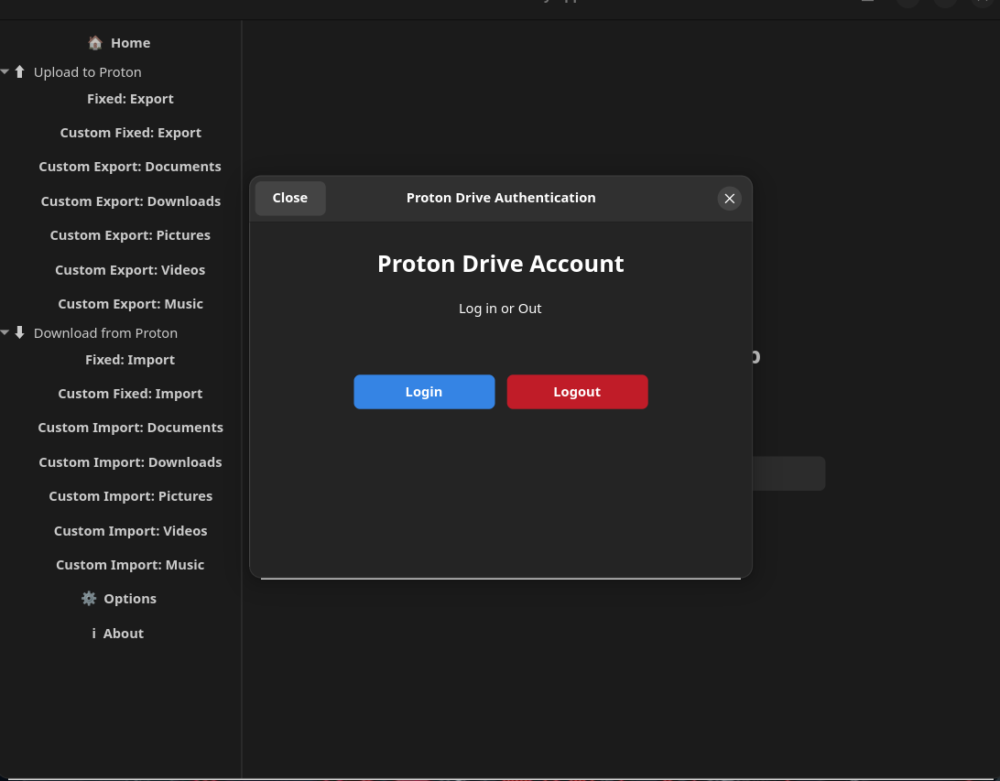

_________________________________________________________

# Proton Drive Utility App 
- Unofficial
- Currently in: _Beta._
- Released Date: _07/03/2026. [MM/DD/YYYY]_
- App version: _v1.2.10 - updated: 09/13/2026. [MM/DD/YYYY]_
- Language: _Python | Shell script_
- Standard Libraries: _subprocess | threading | os | shutil | webbrowser | subprocess_
- GUI Framework: gi (PyGObject) - _The bridge to access C libraries (GTK, Adw)._
- Module(s): _GTK4 | Libadwaita_
- _Opened Sourced & Publicly Available._

_________________________________________________________

## 🌟 Lists of benefits on why This App exists and use cases.

<mark>The Proton AG team is working hard</mark> to build the official Proton Drive for Linux systems.

 #### Having a Proton utility app can have many benifits

- <strong>📤 Importing/Exporting in and out of your Proton Drive is just a click of a button.
- <strong>⬇️ A quick way to download everything, rather than using the Proton Drive web interface.
- <strong>💻 Flexibility for lower-end hardware.
- <strong>🔄 The ability to download multiple times, so you know your data is always backed up and safe.
- 
 > 💡 *You can probably think of more amazing uses for this great app.*
 -
 > If and when the Official Proton Drive App has been released by proton AG and their team surely many out there would still use this App.
 of the many benefits listed above. ☝️

 
<table>
<tr>
<td width="50%" valign="top">
 Information & the Original Author on the Proton Drive Utility App " width="100%">
 

 
<i><b><mark>Home Page - Windowing:</mark></b> (Links to the Main Author and Founder on Developing the *PDUA*)</i>

<h5>Proton Drive Utility App (PDUA).</h5> 
</td>
<td width="50%" valign="top">  as you would use the login method in Command Line Interface." width="100%"> 
  

 
<i>✅ Yes, you can now login within the App.</i>

<h3> The PDUA Windowing Popup</h3>
 
 

 You can now login within the app -   Released Version & Date: v1.2.7 - 08/23/2026. [MM/DD/YYYY]    It's the same functions as you would login using the Proton Drive *Command Line Interface* or *CLI*. But with the Graphical Interface we all know & Love.  

<mark>*Note*: You still need to Copy the URL within the windowing User Interface after clicking Login, then paste the whole URL into the browser. *Hopefully Proton AG and their Team can fix that inconvenient way*.</mark>

</td>
</tr>
</table>

<table>
<td width="50%" valign="top">  as you would use the login method in Command Line Interface." width="100%"> 
  

 
<i>.</i>

<h5> 🫥 Appearances *in the -Drop Down Menu*</h5>
 
 

 You can change the Appearances to Light, Dark, or Your System Default Appearance Settings is set to.  

<mark>Note: there will be other themes to choose from. also the big theming will be the the amazing popular Dark blue theming by Proton AG Services.</mark>
  

 
<td width="50%" valign="top">  Listed of options Login, New Window, Prefernces, Appearances, and Help." width="100%"> 
  

 
<i>.</i>

<b>🔽 DropDown Menu -> *Login, New Window, Prefernces, Appearances, and Help.*</b>
 
 

  

<mark>Note: the Preferences option listed is still needs some work and it's not functional.</mark>
  

</td>
</tr> 
</table>

<table>
<td width="50%" valign="top">  
  

 
<i>.</i>

<h5> 🫥 You can View your Albums and Pictures within the app. instead of viewing in a web browser.</h5>
 
 

 Now you could say Viewing my pictures/Albums is now possible. and should be a right to do so.  

<mark>Note: It's still in testing and not fully working yet. it will show how many albums 'counted' for also can show actual albums names. no thumbnails. working on ways to properly cache the thumbnails in a safe manner. the follows *Proton AG TOS*</mark>
  

 
<td width="50%" valign="top">  Listed of options Login, New Window, Prefernces, Appearances, and Help." width="100%"> 
  

 
<i>.</i>

<b>🔽 DropDown Menu -> *Login, New Window, Prefernces, Appearances, and Help.*</b>
 
 

  

<mark>Note: the Preferences option listed is still needs some work and it's not functional.</mark>
  

</td>
</tr> 
</table>

<table> 
<tr> 
<td width="33%" valign="top"> 
<h4></h4>
</td> <td width="33%" valign="top">
<h4></h4>
</td> <td width="33%" valign="top"> 
<h4> </h4> 
</td></tr> <tr><td width="33%" valign="top"> 
<h4> </h4>
</td> <td width="33%" valign="top"> <h4>
<code></code><code></code><td width="33%" valign="top"> 
<h4></h4></td> 
</tr> 
</table>

<table> 
<tr> 
<td width="33%" valign="top"> 
<h4></h4>
</td> <td width="33%" valign="top">
<h4></h4>
</td> <td width="33%" valign="top"> 
<h4> </h4> 
</td></tr> <tr><td width="33%" valign="top"> 
<h4> </h4>
</td> <td width="33%" valign="top"> <h4>
<code></code><code></code><td width="33%" valign="top"> 
<h4></h4></td> 
</tr> 
</table>

