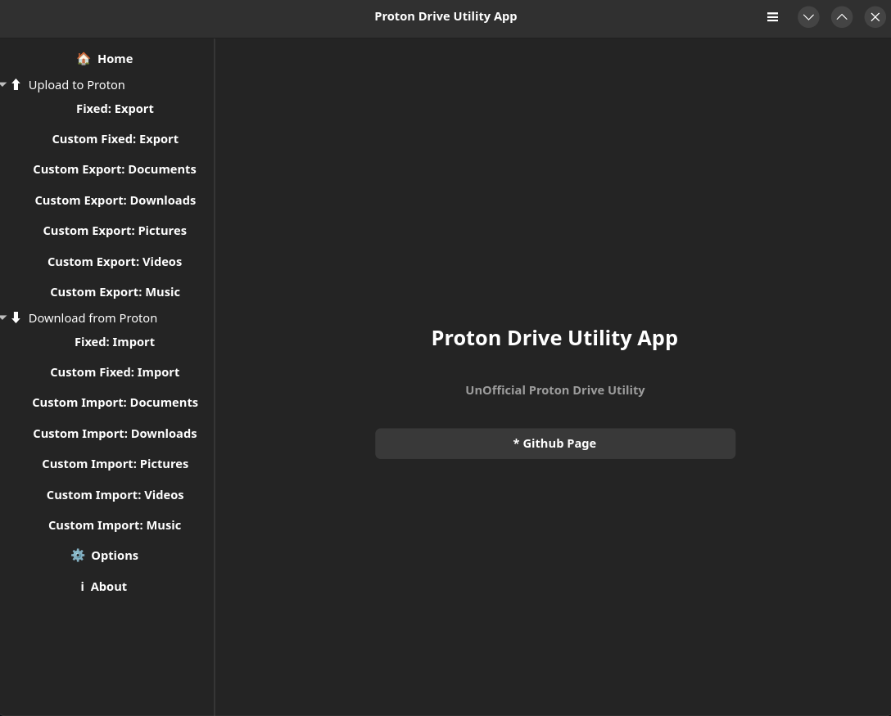

_________________________________________________________

# Proton Drive Utility App 
- Unofficial
- Currently in: _Beta._
- Released Date: _07/03/2026. [MM/DD/YYYY]_
- App version: _v1.2.10 - updated: 09/13/2026. [MM/DD/YYYY]_
- Language: _Python | Shell script_
- Standard Libraries: _subprocess | threading | os | shutil | webbrowser | subprocess_
- GUI Framework: gi (PyGObject) - _The bridge to access C libraries (GTK, Adw)._
- Module(s): _GTK4 | Libadwaita_
- _Opened Sourced & Publicly Available._

_________________________________________________________

<table>

<td width="50%" valign="top">
 Information & the Original Author on the Proton Drive Utility App " width="50%">
 

 
<i>(Links to the Main Author and Founder on Developing the *PDUA*)</i>

<h3>Proton Drive Utility App.</h3> 
</td>
</tr>
<tr> 

<td width="50%" valign="top">  as you would use the login method in Command Line Interface." width="50%"> 
  

 
<i>## ✅ Yes, you can now login within the App.</i>

<h3> The PDUA Windowing Popup</h3>
 
 
<b> You can now login within the app - Released Version and Date: v1.2.7 - 08/23/2026. [MM/DD/YYYY]    It's the same function as you would login using the Proton Drive *Command Line Interface* or *CL*.  </b>
</tr>
</td> 
</table>

<table> 
<tr> 
<td width="33%" valign="top"> 
<h4></h4>
</td> <td width="33%" valign="top">
<h4></h4>
</td> <td width="33%" valign="top"> 
<h4> </h4> 
</td></tr> <tr><td width="33%" valign="top"> 
<h4> </h4>
</td> <td width="33%" valign="top"> <h4>
<code></code><code></code><td width="33%" valign="top"> 
<h4></h4></td> 
</tr> 
</table>

<table> 
<tr> 
<td width="33%" valign="top"> 
<h4></h4>
</td> <td width="33%" valign="top">
<h4></h4>
</td> <td width="33%" valign="top"> 
<h4> </h4> 
</td></tr> <tr><td width="33%" valign="top"> 
<h4> </h4>
</td> <td width="33%" valign="top"> <h4>
<code></code><code></code><td width="33%" valign="top"> 
<h4></h4></td> 
</tr> 
</table>

